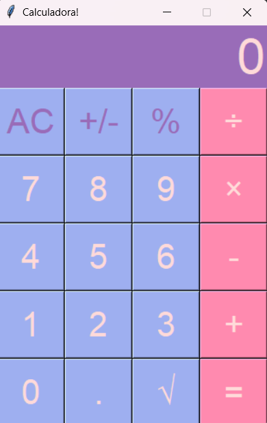

# 🧮 Calculadora de Mesa - Python & Tkinter

Este é um projeto de uma calculadora de mesa moderna, responsiva e robusta, desenvolvida inteiramente em Python utilizando a biblioteca gráfica padrão `tkinter`. 

O projeto foi construído com foco em conceitos de manipulação de estados em tempo de execução, design de interface do usuário (UI/UX) nativa e tratamento preventivo de exceções matemáticas.

---

## 📸 Demonstração do Projeto




---

## ✨ Funcionalidades

- **Operações Matemáticas Básicas:** Adição, subtração, multiplicação e divisão.
- **Operações Avançadas:** Cálculo instantâneo de raiz quadrada (`√`) e porcentagem (`%`).
- **Inversão de Sinal:** Botão `+/-` para alternar rapidamente entre valores positivos e negativos.
- **Tratamento de Exceções Matemáticas:** Prevenção inteligente contra divisões por zero e extração de raiz de números negativos, exibindo de forma elegante a mensagem "Erro" no visor sem travar a aplicação.
- **Experiência de Usuário Premium (UI/UX):** 
  - Botões com simulação de profundidade tátil (efeito 3D usando relevo `raised` e bordas personalizadas).
  - Feedback dinâmico de clique (`activebackground` e `activeforeground`).
  - Paleta de cores moderna e tipografia legível e imponente.

---

## 🛠️ Tecnologias Utilizadas

- **Python 3.x**: Linguagem de programação principal.
- **Tkinter**: Biblioteca gráfica nativa do Python para construção da GUI (Graphical User Interface).

---

## 🚀 Como Instalar e Executar

Como este projeto utiliza apenas bibliotecas nativas do ecossistema Python, não há necessidade de instalar dependências de terceiros.

### Passo 1: Clonar o Repositório
Abra o seu terminal e execute:
```bash
git clone https://github.com/amandamassari/calculadora.git
```

### Passo 2: Acessar a Pasta do Projeto
```bash
cd calculadora
```

### Passo 3: Executar a Aplicação
Execute o arquivo principal no terminal:
```bash
python calculadora.py
```


